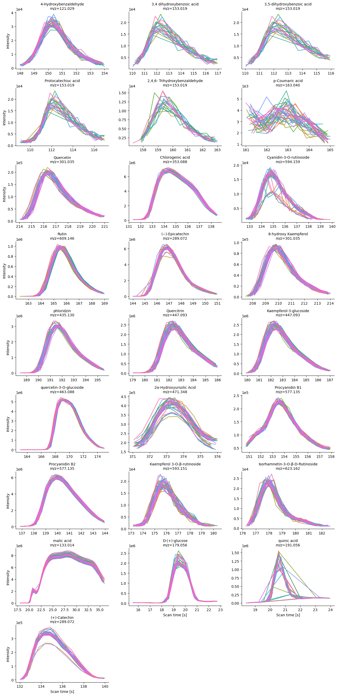
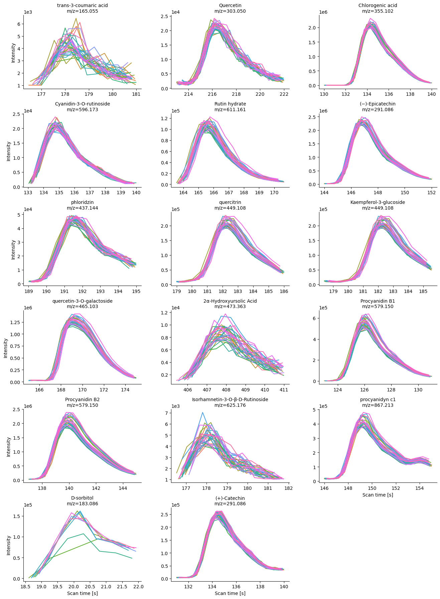

```{r eval=TRUE, include=FALSE}
knitr::opts_chunk$set(fig.path = "")
```

Goal of this notebook

This notebook has the objective to exemplify the use of targeted
integration of phytochemicals that are present in untargeted
metabolomics data of apple fruit reported in [Bilbrey et al.
(2022)](https://nph.onlinelibrary.wiley.com/doi/full/10.1111/nph.17693)

In this case, we are going to use only the quality control (QC) samples.

## Importing python libraries

Importing python libraries

In this section, we will upload the required libraries in order to
targeted integrate a series of phytochemicals found in apples fruits.
The main library for this purpose is ms-mint which allows to integrate
ions of interest. In our case, each ion of interest refers to a specific
phytochemical. For example, chlorogenic acid with a monoisotopic mass of
354.0950 Da. Thus, the ion in positive ionization mode will be 355.1023
m/z, while an ion of 353.0877 m/z corresponds to negative ionization.

``` python
# ms-mint: Instance for MS spectrometry data
from ms_mint.Mint import Mint
import pandas as pd # Data wrangling
import numpy as np
import re # Regular expressions
import glob # listing files
import seaborn as sns
import plotly.express as px # Interactive plots
import pickle # Export python object
#from ms_mint.notebook import Mint
mint = Mint()
```

## Selecting QCs files

### Negative ionization

Here, we are going to select all QC files, and we are printing the first
5 QC files.

``` python
QC_files_neg = glob.glob("Data/mzML/Neg/QC*")
mint.ms_files = QC_files_neg
mint.ms_files[0:5]

['Data/mzML/Neg/QC_035.mzML',
 'Data/mzML/Neg/QC_189.mzML',
 'Data/mzML/Neg/QC_042.mzML',
 'Data/mzML/Neg/QC_014.mzML',
 'Data/mzML/Neg/QC_147.mzML']
```

### Target ion list

``` python
target_list_neg = pd.read_excel("Data/Tables/targets.xlsx", sheet_name = "target_neg")
mint.targets = target_list_neg
mint.targets
```

```{r eval=TRUE, include=FALSE}
library(tidyverse)
library(readxl)
target_neg <- read_xlsx(path = "targets.xlsx", sheet = "target_neg")
```

```{r}
DT::datatable(target_neg)
```

### Running targeted integration

``` python
mint.run(fn = 'Results/Neg/raw_integration.csv')
<ms_mint.Mint.Mint at 0x109083610>
mint.plot.peak_shapes(col_wrap=3)
```



## Positive ionization

On the other side of the ionization polarity, for positive ionization,
we proceed with the same workflow; describing the QCs files first, and
uploading the target list second.

```python
['Data/mzML/Pos/QC_035.mzML',
 'Data/mzML/Pos/QC_189.mzML',
 'Data/mzML/Pos/QC_014.mzML',
 'Data/mzML/Pos/QC_147.mzML',
 'Data/mzML/Pos/QC_203.mzML']
```

### Loading targets

```python
targets_pos = pd.read_excel("Data/Tables/targets.xlsx", sheet_name = "target_pos")
mint.targets = targets_pos
mint.targets
```

```{r include=FALSE, eval=TRUE} 
target_pos <- read_xlsx(path = "targets.xlsx", sheet = "target_neg")
```

```{r}
DT::datatable(target_pos)
```

### Running targeted extraction


```python
mint.run(fn = 'Results/Pos/raw_integration.csv')
<ms_mint.Mint.Mint at 0x109083610>
```

```python
mint.plot.peak_shapes(col_wrap=3)
```



