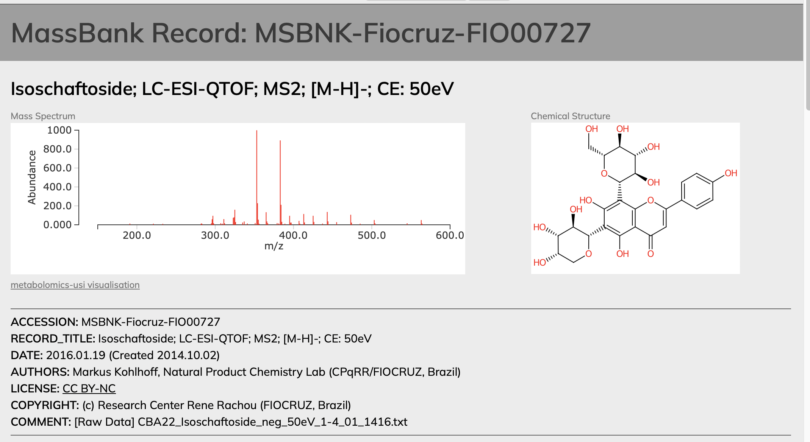

```{r, include = FALSE}
knitr::opts_chunk$set(
  collapse = TRUE,
  comment = "#>",
  fig.path = ""
)
library(MS2extract)
```


## Goal of this document

This post is a step-by-step tutorial about how to create publication-ready 
mirror plots to show the similarities, or differences between an experimental
and reference MS/MS spectra.

This post will assume you have two MS/MS spectra you’d like to compare.
This will most often be an experimental spectrum you’ve collected,
and a reference spectrum from a standard or database. 
By the end of this post, you will be familiar with data visualization
techniques needed to create and customize MS/MS mirror plots.
Some examples of final plots are below:

**Experimental vs. Analytical standard spectrum**

<div style="text-align: center;">
   
</div>

**Experimental vs. literature  spectrum**

<div style="text-align: center;">
   
</div>

**Disclaimer**

> This post will not cover metabolite identification approaches.

There is a lot of material about approaches for metabolite identification
, and we encourage to visit these references if you are not familiar with
this topic.

Here is the list of few places that you can visit to get familiar with
metabolite ID.

-   [GNPS documentation](https://ccms-ucsd.github.io/GNPSDocumentation/)
-   [GNPS tutorial videos](https://www.youtube.com/@dorresteinlab4428)
-   [MS-DIAL/MS-FINDER tutorials](http://prime.psc.riken.jp/compms/msfinder/main.html)

## Introduction

Metabolite identification from untargeted mass spectrometry 
based metabolomics data can be conducted by using different platforms and
approaches. The gold standard is comparing the m/z and retention time of 
a peak in your sample to that of an authentic standard. However, given that
often this type of matching is impossible or impractical, another
commonly usedapproach is comparing the MS/MS fragmentation pattern of your
experimental data against a reference spectrum. This reference spectrum
could come from difference sources. In the best case scenario, you would 
have a reference material (analytical standard), and you will be able to 
collect MS/MS data of this material. Another option is using public or 
licensed MS/MS libraries.

Although the concept of comparing the fragmentation patterns of the experimental
spectrum against a reference spectra sounds fairly easy, this task is not trivial, as
mathematical methods to quantify the similarity between two vectors or matrices are
needed. There is a great read for in this topic that you can direct your
attention if you are interested in this topic 
[Niek F. de Jonge et al. 2022](https://link.springer.com/article/10.1007/s11306-022-01963-y).

Once you have successfully processed your MS/MS data and have found or 
collected an MS/MS spectrum that you think matches your compound, 
you can make a figure that compares those spectra together so
others can evaluate their similarity. 
The first step though is to gather your MS/MS data.


## Gathering MS/MS data

This section aims to briefly explain how to extract MS/MS data from your raw
files to create a table of *m*/*z* values and ion intensities to create
the mirror plot. If you already have these data, you can jump to the 
next section.

Here, I will explain how we extracted the tables containing *m*/*z*  values
and ion intensities for making the mirror plots.
If you want to replicate these plots, you can download these tables.

* [Nictoflorin example data](https://gitlab.com/DanielQuiroz97/danielquiroz97.gitlab.io/-/blob/master/content/post/2023-09-29-making-ms-ms-mirror-plots-to-compare-experimetnal-vs-reference-spectra/data/Nictoflorin.xlsx?ref_type=heads)
* [Isoschaftoside example data](https://gitlab.com/DanielQuiroz97/danielquiroz97.gitlab.io/-/blob/master/content/post/2023-09-29-making-ms-ms-mirror-plots-to-compare-experimetnal-vs-reference-spectra/data/Isoschaftoside.xlsx?ref_type=heads)


### Experimental 

The experimental MS/MS spectrum comes from you data. Either form the raw MS/MS
files, or from the deconvoluted MS/MS peaks.

Here is an example how we used [MZmine3](http://mzmine.github.io) to extract
the *m/z* and ion intensity table from the nictoflorin standard. If you 
want to download the raw nictolorin *.mzml* file, you can find it in the 
[PhenolicsDB](https://cooperstonelab.github.io/PhenolicsDB/) at this
[link](https://github.com/CooperstoneLab/PhenolicsDB/blob/main/inst/extdata/QTOF_6545/Neg/40/40eV_kaempferol3rutinoside_neg_62.mzML)

Once you load your data in [MZmine3](http://mzmine.github.io), you need to select the
MS/MS scan that has the desired MS/MS data. Then, in the MS/MS plot panel,
you can right-click and export this spectrum to an excel file that we are going
to use later.

You can use the same process to extract the data from your experimental files.

<div style="text-align: center;">
   
</div>

### Literature spectra

You need to find the repository or have access to the MS/MS ion
peak list of the literature spectrum. In this case, our literature spectrum matches
to isoschaftoside from MassBank, with the accession number
[MSBNK-Fiocruz-FIO00727](https://massbank.eu/MassBank/RecordDisplay?id=MSBNK-Fiocruz-FIO00727).

Here, you can simply copy the m/z and intensity values to an excel file, or
any file as long as you have these to pieces of information.

<div style="text-align: center;">
   
</div>


## Data Wrangling 

### Loading libraries

Here, we are going to list and load all R libraries needed to create the mirror plots.

```{r message=FALSE, warning=FALSE, paged.print=FALSE}
library(tidyverse) # Data wrangling and plotting
library(readxl) # Importing excel data
library(ggrepel) # Overlapping labels
library(cowplot) # Inserting chemical structure
library(magick) # Importing images in tiff format
```


### Importing MS/MS data

As we mentioned earlier, we are going to work with two examples, the mirror plot
for isoschaftoside and in a next post we will cover the example of the 
nictoflorin mirror plot. While the mirror plot of isoschaftoside
reflects example of a match to a literature spectrum, the nictoflorin mirror 
plot is an example of a math to an analytical standard spectrum.

We are going to show how to create the mirror plot of isoschaftoside first, as it
does not have ions with super close *m/z* values that we need to label, which
requires extra work. 

Both provided excel files has three columns:

* **mz**: *m/z* values
* **intensity**: ion signal intensity
* **Group**: refers if the signal is from the experimental or reference spectrum


```{r}
# Isoschaftoside data
isoschaftoside_data <- readxl::read_excel("data/Isoschaftoside.xlsx", sheet = 1)
glimpse(isoschaftoside_data[seq(3), ])
```
We can note that the `mz` columns was imported as character and not as number.
It is because there are empty characters that prevents R to import this colum
as character. The solution is to use the `parse_number()` function.

```{r}
isoschaftoside_data <- isoschaftoside_data %>% 
  mutate(intensity = parse_number(intensity), # Correcting numeric values
         mz = parse_number(mz))

glimpse(isoschaftoside_data)
```

We can see the `mz` and `intensity` column are properly format as `dbl`,
or a numeric variable. Now, we are going to create two groups in this dataset,
as we have the ions from the experimental and reference spectrum.

```{r}
isoschaftoside_data <- isoschaftoside_data %>% 
  group_by(Group) # Grouping by standard and sample

glimpse(isoschaftoside_data)
```

At the top of the output we can see that two groups were created, the 
`standard` and `sample` group.

### Relative abundance calculation

Since the ion abundance of both spectra are in ion counts 
(i.e., raw abundance), and the scale of the experimental and
standard data are different, we need to calculate the relative abundance, 
that can be calculated by dividing each intensity by the max intensity, 
times 100. This will allow us to compare spectra that have different 
raw intensities.

We can implement this using the code below:

```{r}

isoschaftoside_data <- isoschaftoside_data %>% 
   mutate(Rel_int = intensity/max(intensity)*100) # Relative abundance calc

# Printing ion abundance greater than 50%
isoschaftoside_data %>% filter(Rel_int > 50) 
```


For example, this table shows the ions that has a greater relative abundance
than 50%.

We can also print how many ions are found in both the sample and the standard.

```{r}
isoschaftoside_data %>% count() # Counting number ions per group
```

Until this point, the sample (experimental) and the standard peak list have 605
and 55 ions, respectively. The larger number of ions in sample is attributed to 
the fact that this spectra was not processed to remove low intensity signals.

### Filtering low abundance ions

We can process our data to remove ions with low abundance. In our case, 
we are going to  remove signals below 1.2% intensity, 
and ions less than 280 *m*/*z*. The first
criterion aims to remove low signal ions that are the product of 
background noise. We are also removing ions less than 280 *m*/*z* as reference
spectra do not show any signal below this *m*/*z* value.

Note from authors: With programming you can handle/manipulate your data in an
unlimited ways, so please be honest and report precisely how you process your 
data.


```{r}
isoschaftoside_data <- isoschaftoside_data %>% 
  filter(Rel_int > 1.2) %>%  # Removing signal less than 1.2% intensity
  filter(mz > 280) # Removing ions below 280 m/z
  
isoschaftoside_data %>% count()
```

With the final spectra processing approach, we had a final number of ions of 42 and 50
ions for the sample and standard spectra, respectively.


### Negative intensities for the reference spectrum

If we recall the peak table, both, the experimental and the reference spectra have 
positive values. The core concept of mirror plot is that the reference
spectra has negative intensity values, which will be plotted as the mirror plot
of the experimental spectrum. 

```{r}
isoschaftoside_data %>% filter(Rel_int > 50) 
```

Therefore, we need to make the intensity values of the reference spectrum
to be negative.

```{r}
# Changing standard intensity values to negative
# We eval the match of signals to belong to the standard groups, and
# multiply the intensity value time -1

isoschaftoside_data <- isoschaftoside_data %>% ungroup %>% 
  mutate(Rel_int = ifelse(Group %in% "Standard",
                          Rel_int*-1, Rel_int))

isoschaftoside_data %>% filter(Rel_int > 50 | Rel_int < -50) 
```

Now, we can see that the intensity values from the standard are negative while 
the sample remain positive.

At this point, we finally have the data ready for plotting.

## Plotting a mirror plot

### Backbone plot

The backbone of a mirror plot is a barchart. Therefore, we are going to use
this geometry for this purpose `geom_col()`.

```{r}
isos_mirror <- isoschaftoside_data %>% 
  ggplot(aes(mz, Rel_int,  fill = Group)) +
  geom_col(width = 0.6) 

isos_mirror
```

This is the backbone of our plot, now we are going to work to make it look nicer.

### Changing group colors

Based on the GNPS mirror plot colors, we are going to change to a black
color for the experimental MS/MS, while the reference spectra will be green.

```{r}
isos_mirror <- isos_mirror + 
  scale_fill_manual(values = c(Sample = "#000000", Standard = "#4B9C15"))
isos_mirror
```

### Background color and grids 

The gray background is the default color in ggplot, but we can change this
color to white, remove the grids, and remove the repetitive legend.

```{r}
isos_mirror <- isos_mirror + 
  theme_light() + # Using a white background theme
  theme(legend.position = "none", # Removing legend
        panel.grid.major = element_blank(),  # Removing grins
        panel.grid.minor = element_blank()) 

isos_mirror
```

We have a cleaner plot, but the axis labels need to be altered, and a title
added.

### Changing labels

```{r}
isos_mirror <- isos_mirror + 
  labs(x = "m/z", # X axis label
       y = "Relative intensity (%)", # Y axis label
       title = "Isoschaftoside [M-H]-")# Title label
isos_mirror
```

### Axis limits

The mirror plot is looking more like to the mirror plot we showed at the top
of this post. Next, lets set the *x* and *y* axis limits to make room for 
the additional labels.

```{r message=FALSE, warning=FALSE}
# Text annotation coordinates
annotation_text <- data.frame(
  x = c(170, 160),
  y = c(140, -140),
  label = c("Experimental spectrum 40 eV",
            "Literature spectrum 50 eV"),
  Group = c("Sample", "Standard")
)

isos_mirror <- isos_mirror + 
   ylim(c(-140, 140)) + # Y axis limit
  xlim(c(100, 560)) + # X axis limit
  geom_text(data = annotation_text, 
            aes(x = x, y = y, label = label)) 
isos_mirror
```

### Adding labels

Next, we can proceed to add the labels for the m/z for the most intense ions.
Here, you can take multiple approaches as what ions you want to label. 
For example, in the case of the isoschaftoside mirror plot, we are going to 
use only the ions with a relative abundance greater than 10%. On the other
hand, in the case of nictoflorin, we are going to use the same 10% cutoff,
and we are going to add the precursor ion.e the same 10% cutoff, but we are
going to add the precursor ion.

#### Experimental spectrum lables

```{r message=FALSE, warning=FALSE, paged.print=FALSE}
# Filtering ions in experimental spectrum
isos_labs_pos <- isoschaftoside_data %>%
  filter( Rel_int > 10 ) 

isos_mirror <- isos_mirror + 
  geom_text(data = isos_labs_pos,
            aes(label = abs(round(mz,3)), # Round label to 3 decimal digits
                y = Rel_int),
            size = 3, # Label size 
            angle = 90, # Rotate label 90 degree
            hjust = -0.1)  # Place after the max intensity

isos_mirror
```


#### Reference spectra lables

Finally, we need to add the labels in the reference spectrum.

```{r message=FALSE, warning=FALSE, paged.print=FALSE}
# Filtering ions in the reference spectrum
isos_labs_neg <- isoschaftoside_data %>%
  filter( Rel_int < -10  ) 

isos_mirror <- isos_mirror +
  geom_text(data = isos_labs_neg, aes(label = abs(round(mz,3)),
                                      y = Rel_int),
            size = 3, angle = 90, hjust = 1, vjust = 1, color = "#4B9C15")
isos_mirror
```

At this point, you almost have a final mirror plot. The final (optional) 
step is to add the chemical structure of the metabolite. 

### Inserting the chemical structure

You have couple of options for this task. By far, the easiest is to 
create or get the chemical structure of the metabolite in a different
software (e.g., ChemDraw) and use an image  processing software to 
join the mirror plot and the chemical structure in a final figure. 

There are some online options to create/draw your chemical structure such as
[MolView](https://molview.org),
[PubChem Sketcher](https://pubchem.ncbi.nlm.nih.gov//edit3/index.html), and 
[Chemical Sketch](https://www.rcsb.org/chemical-sketch). We used ChemDraw for
its flexibility in the structure manipulation and because our University
has an institutional subscription (so its free for us), but overall,
for the option to export the chemical structure as .pdf or .svg 
that we can use with more flexibility later in the process of image processing.

For this example, we are providing the .tiff chemical structure that we exported
using chemdraw:

* [isoschaftoside structure](https://gitlab.com/DanielQuiroz97/danielquiroz97.gitlab.io/-/blob/master/content/post/2023-09-29-making-ms-ms-mirror-plots-to-compare-experimetnal-vs-reference-spectra/img/Isoschaftoside_structure.tiff?ref_type=heads)
* [nictoflorin structure](https://gitlab.com/DanielQuiroz97/danielquiroz97.gitlab.io/-/blob/master/content/post/2023-09-29-making-ms-ms-mirror-plots-to-compare-experimetnal-vs-reference-spectra/img/Nictoflorin_structure.tiff?ref_type=heads)


First, we need to import  image, and then we add the image on top of the mirror
plot.

```{r message=FALSE, warning=FALSE, paged.print=FALSE}
isos_structure <- image_read("img/Isoschaftoside_structure.tiff") 

# Use cowplot funcition and use isos_mirror as base plot
isos_mirror_final <- ggdraw(isos_mirror) + 
  draw_image(isos_structure, 
             x = -0.2, # Relative x position
             y = 0, # Relative y position
             scale = 0.4)  # Scaling to fit in the mirror plot
isos_mirror_final
```


Finally, you can export your publication-ready mirror plot having control
over the image size, and resolution with `ggsave()`. 
You can set parameters based on your needs, but here it is an example of
what we used here.

```{r eval=FALSE, include=TRUE}
# svg format
ggsave(plot =  isos_mirror_final, filename = "nictoflorin_mirror.svg",
       dpi = 300) # Resolution

# pdf format
ggsave(plot =  isos_mirror_final, filename = "nictoflorin_mirror.pdf",
       dpi = 300, # resolution
       width = 4, height = 2, units = "cm", # image size
       scale = 5) # image scale

```

If you reached this point of the document, you reached the end of this tutorial.
Please, let us know if this tutorial was useful and your feedback by clicking
the email icon at the button of this page.


